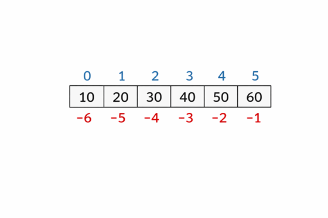

# []()Tóm Tắt Tổng Hợp Kiến Thức Tuần: List, Dictionary 


 1. **List (danh sách)** là cấu trúc dữ liệu linh hoạt của Python: chúng có thứ tự, có thể thay đổi (**mutable**) và cho phép phần tử lặp lại cũng như chứa nhiều kiểu dữ liệu. Cách truy cập bằng chỉ số (indexing) và cắt (slicing), cập nhật và các phương thức thêm/xóa như `append(), extend(), insert(), remove(), pop(), clear(). `
 

 2. **List comprehension và unpacking** giúp viết mã ngắn gọn hơn. List comprehension cho phép tạo danh sách mới bằng một biểu thức kết hợp vòng lặp và điều kiện. Unpacking (dấu *) hữu ích khi gán nhiều biến hoặc nối danh sách. Tránh dùng * để nhân danh sách lồng nhau bởi vì nó tạo các tham chiếu trùng nhau.

 3. **Thuật toán Binary Search** (tìm kiếm nhị phân) giảm thời gian tìm kiếm trên danh sách đã sắp xếp từ **O(n)** xuống **O(log n)**.
 Ý tưởng: lặp lại việc so sánh phần tử ở giữa với giá trị cần tìm và loại bỏ nửa danh sách không cần thiết. Cần đảm bảo danh sách đã được sắp xếp trước khi dùng thuật toán này.

 4. **Dictionary (từ điển)** lưu trữ cặp khóa–giá trị, khóa phải **hashable** và **duy nhất**. Dùng `[ ]` hoặc `get()` để truy xuất giá trị, sử dụng phép gán hoặc `update()` để thêm/cập nhật, và `pop()` hoặc `clear()` để xóa. Tận dụng vòng lặp trên `keys()`, `values()`, `items()` khi cần duyệt.

 5. **Mô phỏng pandas.DataFrame.describe()** bằng dictionary: tách cột số và cột phân loại, loại bỏ None, tính trung bình, độ lệch chuẩn, min, max, percentile (sử dụng nội suy tuyến tính) và mode. Kỹ thuật này áp dụng được cho nhiều bài toán phân tích dữ liệu đơn giản.

___

# Nội Dung Chi Tiết 

## I. List – từ cơ bản đến nâng cao

### 1. Motivation – Tại sao cần list?

&nbsp;&nbsp;&nbsp;&nbsp;Trong Python, List (danh sách) là một cấu trúc dữ liệu dùng để lưu trữ một tập hợp các phần tử có thứ tự, trong đó mỗi phần tử được xác định bằng một chỉ số (index) và có thể thay đổi được trong quá trình thực thi chương trình.

> Nghe có vẻ hơi khó hiểu nhỉ? Để tôi lấy ví dụ nhé!


**&nbsp;&nbsp;&nbsp;&nbsp;&nbsp;&nbsp;&nbsp;&nbsp;&nbsp;&nbsp;&nbsp;&nbsp;&nbsp;&nbsp;&nbsp;&nbsp;&nbsp;&nbsp;&nbsp;&nbsp;&nbsp;&nbsp;&nbsp;&nbsp;&nbsp;&nbsp;&nbsp;&nbsp;&nbsp;&nbsp;&nbsp;&nbsp;&nbsp;&nbsp;&nbsp;&nbsp;&nbsp;&nbsp;&nbsp;&nbsp;Nếu không có List, ta gặp rắc rối gì?**

Ví dụ:


> “Tôi có 100 điểm số của học sinh.
> 
>
> Nếu chỉ có biến `a, b, c, d…` thì tôi phải làm sao?”


Hoặc:

> “Nếu tôi muốn lưu 100.000 bản ghi người dùng thì sao?”


&nbsp;&nbsp;&nbsp;&nbsp;&nbsp;&nbsp;&nbsp;&nbsp;&nbsp;&nbsp;&nbsp;&nbsp;&nbsp;&nbsp;&nbsp;&nbsp;&nbsp;&nbsp;&nbsp;&nbsp;&nbsp;&nbsp;&nbsp;&nbsp;&nbsp;&nbsp;&nbsp;&nbsp;&nbsp;&nbsp;&nbsp;&nbsp;&nbsp;&nbsp;&nbsp;&nbsp;&nbsp;&nbsp;&nbsp;&nbsp;**Tại sao cách cũ không ổn?**

Ví dụ:


```
score1 =8
score2 =9
score3 =7
...


```


Nếu làm như vậy thì bạn có thể sẽ:


- Không lặp được

- Không sort được

- Không tìm kiếm được

- Không scale
 

=> Vậy nên **LIST** được ra đời để giải quyết những vấn đề trên và hơn thế nữa!
   

### 2. Đặc điểm và truy cập

&nbsp;&nbsp;&nbsp;&nbsp;Đặc điểm: list có thứ tự (**ordered**), chứa được nhiều kiểu dữ liệu, cho phép lặp lại phần tử và có thể thay đổi (**mutable**). Mỗi phần tử được đánh số bằng chỉ số (**index**) bắt đầu từ 0. Python cũng hỗ trợ chỉ số âm, ví dụ -1 là phần tử cuối cùng, -2 là phần tử kế cuối.


```python
lst = ['Tôi', 'Là', 'Thành', 'AIO', 'VIETNAM']
```

|&nbsp;&nbsp;&nbsp;&nbsp;&nbsp;&nbsp;&nbsp;&nbsp; Vị trí |&nbsp;&nbsp;&nbsp;&nbsp; 0 |&nbsp;&nbsp;&nbsp;&nbsp; 1 |&nbsp;&nbsp;&nbsp;&nbsp;&nbsp;&nbsp;&nbsp;&nbsp; 2 | &nbsp;&nbsp;&nbsp;&nbsp;3 | &nbsp;&nbsp;&nbsp;&nbsp;&nbsp;&nbsp;&nbsp;&nbsp;&nbsp;&nbsp;&nbsp;&nbsp;4 |
| :---: | :---: | :---: | :---: | :---: | :---: |
| Giá trị | 'Tôi' | 'Là' | 'Thành' | 'AIO' | 'VIETNAM' |
| Chỉ số âm | -5 | -4 | -3 | -2 | -1 |

&nbsp;&nbsp;&nbsp;&nbsp;Để minh họa trực quan hơn, hình dưới cho thấy cách đánh số chỉ mục dương và âm trong một danh sách 5 phần tử:


**&nbsp;&nbsp;&nbsp;Slicing (cắt lát)**: cú pháp **lst [ start:end:step ]** trả về danh sách con từ chỉ số start tới end-1 với bước nhảy step. 
Ví dụ:

```python
numbers = [0, 1, 2, 3, 4, 5, 6, 7]
numbers[2:6]      # [2, 3, 4, 5]
numbers[:3]       # [0, 1, 2]
numbers[::2]      # [0, 2, 4, 6]
numbers[::-1]     # đảo ngược danh sách
```
&nbsp;&nbsp;&nbsp;⚠️ **Lỗi sai** mà người mới hay mắc phải: ***Chỉ số end không bao gồm phần tử tại vị trí đó***.


### 3. Thao tác với list: thêm, cập nhật, xóa

&nbsp;&nbsp;&nbsp;Các phương thức phổ biến bao gồm:


|&nbsp;&nbsp;&nbsp;&nbsp;&nbsp;&nbsp;&nbsp;&nbsp;&nbsp; Method | &nbsp;&nbsp;&nbsp;&nbsp;&nbsp;&nbsp;&nbsp;&nbsp;&nbsp;&nbsp;&nbsp;&nbsp;&nbsp;&nbsp;&nbsp;&nbsp;&nbsp;&nbsp;&nbsp;&nbsp;&nbsp;&nbsp;&nbsp;&nbsp;&nbsp;&nbsp;&nbsp;&nbsp;&nbsp;&nbsp;&nbsp;&nbsp;&nbsp;&nbsp;&nbsp;&nbsp;&nbsp;&nbsp;&nbsp;&nbsp;&nbsp;&nbsp;Mô tả |
|--------|--------|
| append(x)  | thêm một phần tử vào cuối. |
| extend(iterable) | nối toàn bộ các phần tử từ iterable khác. |
| insert(i, x) | chèn x vào vị trí i. |
| remove(x)  | xóa lần xuất hiện đầu tiên của x. |
| pop(i) | xóa và trả về phần tử ở vị trí i (mặc định -1). |
| clear() |  xóa toàn bộ phần tử. |


Ngoài ra, bạn có thể cập nhật giá trị bằng chỉ số hoặc bằng slicing:

```python
fruits = ['apple', 'banana', 'cherry']
fruits[1] = 'orange'          # update by index
fruits[1:3] = ['grape', 'kiwi']  # update multiple via slice

print (fruits)        #['apple', 'grape', 'kiwi']
```


&nbsp;&nbsp;&nbsp;⚠️**Lỗi sai** mà tôi đã mắc phải: 
1. Phân biệt append (thêm một mục) với extend (thêm từng mục của iterable).

```python
a = [1, 2]
a.append([3, 4])
print(a)            #[1, 2, [3, 4]]
```

> &nbsp;&nbsp;&nbsp;Đấy bạn thấy không nó lại bê nguyên cả cụm vào, và tôi nhận ra rằng khi dùng append thì ta chỉ nên truyền vào 1 đối số mà thôi, bạn thử truyền a.append (3,4) là nó Error ngay. Không tin thì thử mà xem 🙄👍


```python
a = [1, 2]
a.extend([3, 4])
print(a)            #[1, 2, 3, 4]

```

>&nbsp;&nbsp;&nbsp; tôi hay phân biệt là extend với append là tưởng tượng là có 1 cái hộp thì append "lười" bê nguyên cái hộp vào. Còn extend thì "chăm" mở hộp ra và xếp vào. Bạn đọc muốn hình dung sao cũng được miễn là dễ nhớ!  


2. Dùng * để nhân list sẽ tạo bản sao lặp lại danh sách; điều này nguy hiểm với list lồng nhau vì nó tạo các tham chiếu giống nhau cho mỗi hàng.


```python
matrix = [[0] * 3] * 3
print(matrix) 

[[0, 0, 0],
 [0, 0, 0],
 [0, 0, 0]]

#Tôi muốn sửa vị trí hàng 0 , cột 0 là giá trị 9 
matrix[0][0] = 9

print(matrix)
[[9, 0, 0],
 [9, 0, 0],
 [9, 0, 0]]


```

> Thực chất là chúng đang cùng tham chiếu đến cùng 1 vị trí, 
` matrix = [[0] * 3] * 3` là lặp lại tham chiếu chứ không tạo ra bản sao khác. Vì vậy khi bạn thay đổi giá trị ở 1 vị trí thì 2 rows còn lại sẽ tự thay đổi theo

```python
matrix = []
for _ in range(3):
    matrix.append([0, 0, 0])
print(matrix)           # Test in ra kết quả giống y như trên

matrix [0][0] = 9       # Đây là bước thay đổi giá trị
print (matrix)			# Ở bước này tôi test xem như nào

```
=> Đố bạn biết kết quả khi in là gì?Đoán đúng vào FB: Thành Thành tôi cho kẹo


### 4. List comprehension và unpacking

&nbsp;&nbsp;&nbsp;List comprehension cho phép xây dựng danh sách một cách ngắn gọn từ một iterable kết hợp điều kiện if. 
Cú pháp: [biểu_thức -  for biến in iterable - if điều_kiện]. Ví dụ:


```python
squares = [x**2 for x in range(6)]          # [0,1,4,9,16,25]
evens = [x for x in range(10) if x % 2 == 0] # [0,2,4,6,8]
```


&nbsp;&nbsp;&nbsp;Unpacking dùng dấu * để giải nén phần tử, hữu ích khi gán nhiều biến hoặc nối danh sách:

```python
first, *middle, last = [1, 2, 3, 4, 5]  
#first=1, middle=[2,3,4], last=5

new_list = [0, *squares, 100]         
kết quả: [0,0,1,4,9,16,25,100]
```

### 5. 2D list – tạo và truy cập
&nbsp;&nbsp;&nbsp;Bạn có thể coi list 2 chiều như ma trận (danh sách chứa danh sách). Để tạo một ma trận 3×3, không nên dùng [[0]*3]*3 vì cả ba hàng sẽ tham chiếu tới cùng một list con. Thay vào đó dùng comprehension hoặc vòng lặp:

**Cách sai**❌: tất cả hàng trỏ về cùng danh sách

```python
matrix_bad = [[0]*3]*3
matrix_bad[0][0] = 7
print(matrix_bad)  # [[7,0,0],[7,0,0],[7,0,0]]
```


**Cách đúng**✅: 

```python
matrix = [[0]*3 for _ in range(3)]
matrix[0][0] = 7
print(matrix)  # [[7,0,0],[0,0,0],[0,0,0]]
```

Truy cập phần tử bằng cú pháp matrix[row][col]. 
Hình dưới minh họa ma trận 3×3 với chỉ số hàng và cột:



     
### 6. Thuật toán Binary Search
&nbsp;&nbsp;&nbsp; Thực ra còn nhiều các thuật toán khác như: Bubble Sort, Slicing Window, Prefix Sum. Nhưng tôi thấy thuật toán Binary Search này khá hay nên tôi đã lựa chọn nó. Những thuật toán trên bạn có thể tìm hiểu thêm trên internet hoặc nếu bạn muốn tôi chia sẻ chúng thì cứ bảo tôi nhé!

- Motivation: Khi danh sách đã sắp xếp, tìm kiếm tuyến tính **O(n)** trở nên lãng phí. Binary search giảm số phép so sánh xuống **O(log n)** bằng cách chia đôi.

- Ý tưởng: So sánh giá trị tìm kiếm với phần tử ở giữa danh sách (chỉ số mid). Nếu bằng nhau ⇒ trả về. Nếu nhỏ hơn ⇒ tìm ở nửa bên trái (right = mid - 1), nếu lớn hơn ⇒ tìm ở nửa bên phải (left = mid + 1). Tiếp tục cho tới khi left > right.

Cú pháp + ví dụ:

```python
def binary_search(arr, target):
    left, right = 0, len(arr) - 1
    while left <= right:
        mid = (left + right) // 2
        if arr[mid] == target:
            return mid
        elif arr[mid] < target:
            left = mid + 1
        else:
            right = mid - 1
    return -1  # không tìm thấy

data = [1, 3, 4, 5, 8, 10, 12]
print(binary_search(data, 5))   # 3
print(binary_search(data, 6))   # -1
```

&nbsp;&nbsp;&nbsp;Có một vài lưu ý cho thuật toán này là chỉ áp dụng với **danh sách đã sắp xếp**. Cần tránh lỗi **off‑by‑one (điều kiện left <= right)** và đảm bảo cập nhật đúng left hoặc right. Hình dưới minh họa các bước của tìm kiếm nhị phân:

&nbsp;&nbsp;&nbsp;Ví dụ ở trong bài học mình thấy khá dễ hiểu, TA Nhã có lấy ví dụ 2 bạn học sinh chơi đoán số với nhau trong vòng 7 lượt, đoán con số bất kì từ 1-100.

- Bạn A: (ngầm nghĩ tới) số 70
- Bạn B đoán: 50 đúng không?
- Bạn A: Lớn hơn
- Bạn B: thế 80?
- Bạn A: Nhỏ hơn
- Bạn B: Vậy đáp án là số 70 đúng k?
- Bạn A: Chính xác!


> Tức là ở mỗi lần đoán thì bạn B đã được loại đi 50% các số sai rồi


## II. Dictionary – làm việc với cặp khóa‑giá trị


### 1.  Motivation – tại sao dùng dictionary?

Vấn đề khi sử dụng `list` để lưu trữ dữ liệu là nó tìm kiếm dữ liệu rất chậm vì phải trải qua nhiều bước duyệt qua index

```python
names  = ["An", "Bình", "Chi"]
scores = [8, 7, 9]

```
> Nếu bạn muốn biết điểm của bạn Bình là bao nhiêu thì sao? 
Và tôi không chỉ có 10 mà có đến tận 1 triệu học sinh thì sao?

&nbsp;&nbsp;&nbsp;Bạn cần phải duyệt qua vòng lặp `for loop` để tìm được "Bình" sau đó dùng vị trí đó để tìm đến điểm số tương ứng của bạn đó. Rất lâu và rườm rà !

&nbsp;&nbsp;&nbsp;Do đó bạn cần kiểu dữ liệu `DICTIONARY`, kiểu dữ liệu này cho phép bạn lưu trữ dữ liệu theo dạng `"Key" : Value`. 

&nbsp;&nbsp;&nbsp;Nói tóm lại là bạn cứ hình dung nó như kiểu bạn lưu trong danh bạ điện thoại ấy: `"Tên" : Số điện thoại` 

Ví dụ


```python
scores = {"An": 8, "Bình": 7, "Chi": 9}
print(scores["Bình"])  # 7
```


### 2. Đặc điểm cơ bản


&nbsp;&nbsp;&nbsp;Dictionary chứa các cặp key: value. Khóa **Key** phải **hashable** (kiểu bất biến như số, chuỗi, tuple) và **duy nhất**; giá trị **Value** có thể là bất kỳ đối tượng nào.

> Tại sao lại thế ư ? 

&nbsp;&nbsp;&nbsp;Bởi vì nếu lưu trùng khóa đến khi gọi khóa đó để tìm giá trị thì máy tính sẽ không biết phải trả về kết quả nào, còn nếu bạn gắn lại cùng key, nó sẽ ghi đè lên Value cũ.


&nbsp;&nbsp;&nbsp;Một vài ví dụ truy xuất giá trị:


```python
score = {'Alice': 85, 'Bob': 92}  

score['Alice']       
# 85

score.get('Carol')   
# None nếu không có  

score.get('Bob', 0)  
# 92
```


&nbsp;&nbsp;&nbsp;Thường thì người ta dùng `get()` để trả về `None` hoặc giá trị mặc định nếu khóa không tồn tại, để tránh lỗi `KeyError`.

### 3. Thêm, cập nhật và xóa phần tử

| Method |&nbsp;&nbsp;&nbsp;&nbsp;&nbsp;&nbsp;&nbsp;&nbsp;&nbsp;&nbsp;&nbsp;&nbsp;&nbsp;&nbsp;&nbsp;&nbsp;&nbsp;&nbsp;&nbsp;&nbsp;&nbsp;&nbsp;&nbsp;&nbsp; Mô tả |
|--------|--------|
| dict[key] = value | Thêm hoặc cập nhật giá trị bằng phép gán |
| update() |  Cho phép hợp nhất dictionary khác. |
| pop(key) | Trả về giá trị đã xóa |
| clear() | Xoá toàn bộ |


&nbsp;&nbsp;&nbsp;`for loop `trong Dictionary:

```python
info = {'name': 'Mai', 'age': 20, 'city': 'Hanoi'}
for k in info.keys():   
    print(k)                    # name     age     city
for v in info.values():
    print(v)                    # Mai      20     Hanoi
for k, v in info.items():
    print(k, v)                 # name Mai         age 20         city Hanoi
```

### 4. Nested dict và truy cập sâu
&nbsp;&nbsp;&nbsp;Nested dict đơn giản là các Dictionary lồng vào nhau. 

Ví dụ:
```python
student = {
    'id': 'SV01',
    'scores': {'math': 9, 'eng': 8},
    'contact': {'phone': '0123', 'email': 'sv@example.com'}
}
print(student['scores']['math'])  # 9
```

&nbsp;&nbsp;&nbsp;Bạn nhớ là khi thao tác trên dictionary lồng nhau cần cẩn trọng để tránh `KeyError`; nên dùng `get()` trên từng lớp hoặc `dict.get(..., {})` để có dict rỗng khi khóa không tồn tại.
### 5. Patterns quan trọng – counting và grouping
&nbsp;&nbsp;&nbsp;Counting frequency một pattern phổ biến là đếm tần suất xuất hiện của các phần tử trong list. Sử dụng dict.get() với giá trị mặc định để tăng dần

 - Ví dụ:
>Một từ xuất hiện mấy lần trong văn bản?
Mỗi sản phẩm được mua bao nhiêu lần?
Có bao nhiêu học sinh đạt điểm 9 ở kì thi ĐH?


```python
def count_freq(items):
    freq = {}
    for item in items:
        freq[item] = freq.get(item, 0) + 1
    return freq


print(count_freq(['a','b','a','c','b','a']))
# {'a': 3, 'b': 2, 'c': 1}
```


&nbsp;&nbsp;&nbsp;Ở phần code `freq.get(item, 0)` ta để get trả về 0 khi khóa chưa tồn tại thay vì gây lỗi `KeyError` và cũng không để là `None`, `Default` vì `str` không + được cho 1. 

&nbsp;&nbsp;&nbsp;Grouping bằng setdefault có nghĩa là bạn gom nhiều giá trị có cùng 1 đặc điểm vào cùng 1 nhóm
- Ví dụ:
> Gom học sinh theo lớp
Gom sản phẩm theo size
Gom các từ dựa theo chữ cái đầu tiên


```python
def group_by_first_letter(words):
    groups = {}
    for w in words:
        key = w[0]            				# 'apple'[0] → key là 'a'
        groups.setdefault(key, []).append(w)      #groups = {'a': []} sau đó append['apple']

    return groups

print(group_by_first_letter(['apple','banana','cherry','avocado']))
# {'a': ['apple', 'avocado'], 'b': ['banana'], 'c': ['cherry']}
```

&nbsp;&nbsp;&nbsp;Ta dùng `setdefault(key, default)` trả về giá trị hiện tại nếu khóa tồn tại; ngược lại tạo khóa với giá trị default là [ ].

&nbsp;&nbsp;&nbsp;**Ý tưởng** cho phần code này là:

- Bạn lấy chữ cái đầu làm khóa 
- Nếu khóa đó chưa tồn tại thì tạo ra 1 danh sách rỗng, còn nếu đã tồn tại thì không cần tạo mới
- Thêm từ đó vào danh sách tương ứng

### 6. Mini project – mô phỏng pandas describe bằng dictionary
&nbsp;&nbsp;&nbsp;Trong pandas, phương thức DataFrame.describe() trả về các thống kê cơ bản. Ta có thể mô phỏng cho dữ liệu `dictionary`.

&nbsp;&nbsp;&nbsp;Có rất nhiều thông tin được trả về khi dùng hàm DataFrame.describe() nhưng tôi sẽ chỉ tập trung và giải thích ý nghĩa của những hàm mà tôi cảm thấy xa lạ và chưa hiểu nó là gì ngay từ lần đầu học, những cái còn lại thì tôi sẽ nêu ra những lưu ý của chúng. 


| Các loại thông kê | Dữ liệu | 
|--------|--------|
| Thống kê số | - count<br> - mean<br> - std (Standard Deviation: độ lệch chuẩn) <br> - percentile ( Phân vị)| 
| Thống kê phân loại | - count <br> - unique <br> - top (mode)<br> - freq (số lần xuất hiện của top) |


&nbsp;&nbsp;&nbsp;Ý nghĩa:
1. Hàm `count` đơn giản là đếm xem có bao nhiêu dữ liệu **hợp lệ**, tôi nói hợp lệ là bởi vì hàm này sẽ không đếm những giá trị `None`. 

> Giống như kiểu lớp học có 40 bạn thì 2 bạn nghỉ ốm thì count = 38 thôi.

2. Hàm 'mean' chúng đại diện cho "trung tâm" của dữ liệu khi ta tổng trung bình cộng chúng lại.

> Môn Toán 9 điểm, môn Anh 8 điểm, môn Văn 7 điểm thì mean = 8 điểm

3. Hàm std là viết tắt của Stardard deviation nghĩa là độ lệch chuẩn, hàm này để đo mức độ **phân tán** của dữ liệu so với giá trị trung bình **mean**. Nếu độ lệch chuẩn std càng lớn thì dữ liệu càng thiếu ổn định và thất thường, và std thấp thì ngược lại.

> Ví dụ có 2 vận động viên thi bắn súng:
VĐV A: 8, 9, 10, 9, 8 (Trung bình 8.8, std thấp -> VĐV này phong độ rất ổn định).
VĐV B: 10, 6, 10, 8, 10 ( Trung bình cũng 8.8, std cao -> VĐV này phong độ thất thường).

&nbsp;&nbsp;&nbsp;Công thức tính độ lệch chuẩn:
$$\sigma = \sqrt{\frac{1}{n-1}\sum_{i=1}^{n}(x_{i}-\mu)^{2}}$$
	
Trong đó: 


|  Ký hiệu  | Nghĩa |
|--------|--------|
| $σ$ | Phương sai |
| $x_i$ | Giá trị dữ liệu thứ i (từng con số trong dataset) |
| $\mu$ | Giá trị trung bình |
| $x_i - \mu$ | Khoảng cách của từng giá trị so với trung bình |
| $(x_i - \mu)^2$ | Bình phương khoảng cách (để khỏi âm) |
| $\sum$ | Cộng tất cả lại |
| $n$ | Số lượng dữ liệu |
| $n-1$) | Hiệu chỉnh thống kê (Bessel correction) |
| $\sqrt{}$ | Căn bậc hai (đưa về cùng đơn vị ban đầu) |


- Nếu áp dụng công thức để tính với vận động viên A ta thấy

| i vòng | $x_i$ | $xi−μ$ | $(xi−μ)^2$ |
|--------|--------|--------|--------|
| 1 | 8 | -0.8 | 0.64 |
| 2 | 9 | 0.2 | 0.04 |
| 3 | 10 | 1.2 | 1.44 |
| 4 | 9 | 0.2 | 0.04 |
| 5 | 8 | -0.8 | 0.64 |
| Tổng | 44 |  | 2.80 |


- Độ lệch chuẩn $\sigma = \sqrt{\frac{2.80}{5 - 1}} = \sqrt{\frac{2.80}{4}} = 0.70$.
- Bạn làm tương tự với VĐV B để so sánh và đối chiếu.

4. Hàm **Percentile** có nghĩa là Phân vị, hàm này cho ta biết có $p\%$ dữ liệu nằm ở dưới hoặc bằng nó. Nó giúp ta có cái nhìn tổng thể về 1 dữ liệu cụ thể đang đứng ở đâu trong bảng xếp hạng tổng thể.

> Kiểu như bạn vừa trải qua 1 kì thi đại học và Phân vị của bạn là thứ 90 thì có nghĩa là điểm số của bạn cao hơn 90% số người đi thi

&nbsp;&nbsp;&nbsp;Nếu cho tôi list data đã được Sorted thì ban đầu công thức tính cho Percentile chỉ đơn giản là:
$$i = (n-1) \times \frac{P}{100} $$
&nbsp;&nbsp;&nbsp;Ví dụ: Phân vị thứ 50 của data sau sẽ là $i = (5-1) \times \frac{50}{100}  = 2$. Và đếm từ index 0 ->2 ta thấy tại vị trí 2 thì kết quả là số 5 chính là phân vị thứ 50 của data. 
&nbsp;&nbsp;&nbsp;Có nghĩa là nó lớn hơn 50% số data trong toàn bộ dữ liệu.

```python
index  0  1  2  3  4
data   1  3  5  7  9
```


> ⚠️ Vấn đề nằm ở chỗ không phải lúc nào $i$ cũng cho ra kết quả là số nguyên, vậy câu hỏi đặt ra là Nếu $i$ là số thập phân thì sao? trả về kết quả gì?

&nbsp;&nbsp;&nbsp;Lúc này ta cần phải sử dụng đến **Linear Interpolation** ( Nội suy tuyến tính) và công thức tổng quát và cách tính của nó là:

- **Bước 1: Sắp xếp dữ liệu**
$$
X_{\text{sorted}} = \{x_0, x_1, \ldots, x_{n-1}\}
$$
	Tôi phải đề cập tới bước sorted dữ liệu này đầu tiên bởi vì nếu không sắp xếp thì percentile sẽ không biết "25% đầu" hay "90% cuối" là phần nào.

- **Bước 2: Xác định vị trí thực (Index calculation)**
$$i = (n-1) \times \frac{P}{100} $$
	Cũng giống như công thức ở trên thôi vì cần tìm ra index nhận giá trị thập phân là bao nhiêu
   
- **Bước 3: Nội suy giá trị**
 	1. Đầu tiên t lấy 2 index mà $i$ đang nằm ở giữa trong đó: $lower=⌊i⌋$ (làm tròn xuống) và $upper = [i]$ (làm tròn lên)
 
 	2. Weight (w) là khoảng cách từ $lower$ đến $i$:&nbsp;&nbsp;&nbsp;&nbsp;&nbsp;&nbsp; $w = i - lower [i]$
    
    3. Công thức Linear Interpolation (Nội Suy Tuyến Tính)
    $$
V_p = x_{\text{lower}}(1 - w) + x_{\text{upper}}w
$$

    
 	4. Ví dụ minh họa

	```python
	[10, 20, 30, 40]  (đã sort)
	n = 4
	```
	**Tính P25**
    $$i = (n-1) \times \frac{P}{100} = (4-1) \times \frac{25}{100}= 0.75 $$

	- $lower = [0.75] = 0$
	- $upper= [0.75] = 1$
    - $w = i - lower[i] = 0.75 - 0 = 0.75$
    - Linear Interpolation là: $$
V_{25} = x_0(1 - 0.75) + x_1(0.75)
= 10(0.25) + 20(0.75)
= 2.5 + 15
= 17.5
$$
 
  - **Kết luận: P25 là 17.5 và nó nằm ở giữa 10 và 20 nhưng sẽ nghiêng về phía 20 hơn vì $w = 0.75$**
&nbsp;&nbsp;&nbsp;* Hình minh họa nội suy tuyến tính:

<p align="center">
  
</p>


**CHEATSHEET CHO PHẦN NÀY.** 

| Chỉ số | Trả lời cho câu hỏi | Ứng dụng thực tế |
|--------|--------|--------|
| Count | Có bao nhiêu mẫu? | Kiểm tra độ đầy đủ của dữ liệu. |
| Mean | Giá trị chung là bao nhiêu? | Tính lương trung bình, điểm trung bình. |
| Std | Dữ liệu có ổn định không? | Đánh giá rủi ro chứng khoán, quản lý chất lượng sản phẩm. |
| Percentile | Vị trí so với đám đông? | Xếp hạng học lực, xác định mức thu nhập cao trong xã hội. |


    
    
    

Dưới đây là code của hàm mô phỏng describe:

```python
def calculate_percentile(sorted_vals, p):
    n = len(sorted_vals)
    if n == 0:
        return None
    i = (n - 1) * p / 100
    f = int(i)
    w = i - f
    if f + 1 < n:
        return sorted_vals[f] + w * (sorted_vals[f + 1] - sorted_vals[f])
    return sorted_vals[f]

def get_mode(lst):
    freq = {}
    for x in lst:
        freq[x] = freq.get(x, 0) + 1
    max_count = max(freq.values())
    mode = [k for k, v in freq.items() if v == max_count]
    return mode[0], max_count

def describe_dict(data):
    result = {}
    for col, values in data.items():
        vals = [v for v in values if v is not None]
        if not vals:
            continue
        # numeric check
        if all(isinstance(v, (int, float)) for v in vals):
            sorted_vals = sorted(vals)
            count = len(sorted_vals)
            mean = sum(sorted_vals) / count
            variance = sum((x - mean)**2 for x in sorted_vals) / count
            std = variance**0.5
            result[col] = {
                'count': count,
                'mean': mean,
                'std': std,
                'min': sorted_vals[0],
                '25%': calculate_percentile(sorted_vals, 25),
                '50%': calculate_percentile(sorted_vals, 50),
                '75%': calculate_percentile(sorted_vals, 75),
                'max': sorted_vals[-1],
            }
        else:
            mode, freq_val = get_mode(vals)
            result[col] = {
                'count': len(vals),
                'unique': len(set(vals)),
                'top': mode,
                'freq': freq_val,
            }
    return result

sample = {
    'age': [20, 22, 19, None, 21, 20],
    'gender': ['F','M','F','F','M','F']
}
print(describe_dict(sample))
```


## III. Tổng kết

&nbsp;&nbsp;&nbsp;Qua bài blog của tôi thì quý bạn đọc đã học và nắm rõ được các mục sau:


1. **Tính chất list**: ordered, mutable, heterogeneous ( không đồng nhất), cho phép lặp lại.


2. **Truy cập list**: lst[i], lst[-1], slicing lst[start:end:step].

3. **Phương thức list**: append(x), extend(iterable), insert(i,x), remove(x), pop(i), clear().


4. **List comprehension**: [expr for x in iterable if condition].


5. **Unpacking**: a, *b, c = lst.


6. **Tạo list 2D đúng**: [[0]*cols for _ in range(rows)].


7. **Binary search**: yêu cầu danh sách đã sắp xếp; dùng vòng lặp while với left, right, mid.

8. **Tính chất dict**: key hashable, unique; truy xuất an toàn với get().
   
9. **Thao tác dict**: gán và cập nhật bằng dict[key] = val, update(), xóa bằng pop(), clear().
 
10. **Patterns về Counting và Grouping**:  freq[item] = freq.get(item, 0) + 1; và grouping: setdefault.
     
11. **Mô phỏng describe**: tính số lượng, trung bình, độ lệch chuẩn, percentile bằng nội suy, mode cho dữ liệu phân loại.

________________________________________
## Tài liệu tham khảo:
- [[1] Counting the Frequencies in a List Using Dictionary in Python - GeeksforGeeks](https://www.geeksforgeeks.org/python/counting-the-frequencies-in-a-list-using-dictionary-in-python/) 
- [[2] Slide Bài Giảng AIO 2026 : Warm up - Review 06 [Advanced List] 12 - 1 - 2026 _ Đăng Nhã ](https://lms.aivietnam.edu.vn/api/files/68f385e4ff94a46e0f82c7d8/Documents%2F2026-0%2FWARM%20UP%2001%20-%20REVIEW06%20%5BAdvanced%20List%5D%2F%5BSlide%5D%20-%20Advanced%20List_V2.pdf)
- [[3] Predocs AIO 2026: 12 - 1 - 2026](https://lms.aivietnam.edu.vn/api/files/68f385e4ff94a46e0f82c7d8/Documents%2F2026-0%2FWARM%20UP%2001%20-%20REVIEW06%20%5BAdvanced%20List%5D%2F%5BPredocs%5D%20-%20Advanced%20List.pdf)
- [[4] Slide Bài Giảng AIO 2026: Warm up - Review 7 [Dictionary] 15-1-2026 _ TA Quốc Thái ](https://lms.aivietnam.edu.vn/api/files/68f38611ff94a46e0f82c7d9/Documents%2F2026-0%2FWARM%20UP%2001%20-%20REVIEW07%20%5BDictionary%5D%2F%5BSlide%5D-WarmUp-07-Dictionary.pdf)
- [[5] Predocs AIO 2026:  15-1-2026](https://lms.aivietnam.edu.vn/api/files/68f38611ff94a46e0f82c7d9/Documents%2F2026-0%2FWARM%20UP%2001%20-%20REVIEW07%20%5BDictionary%5D%2F%5BDescription%5D-WarmUp-07-Dictionary.pdf)
